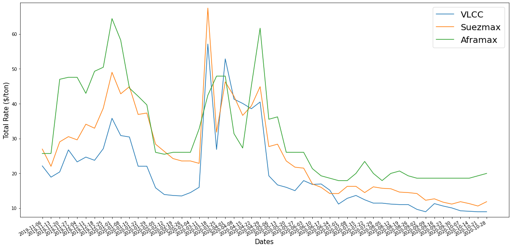
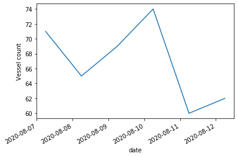

# Tutorials

Here you will find examples for each one of our APIs. There are also Jupyter Notebooks 
you can run, inside our [docs](https://github.com/SignalOceanSdk/SignalSDK/tree/master/docs/examples/jupyter) in the 
[Signal Ocean SDK repository](https://github.com/SignalOceanSdk/SignalSDK/).

## Freight Pricing

The Freight pricing API retrieves freight prices for moving commodities between two port.

The following function is available:

```
get_freight_pricing
```

Args:

```
vessel_type: The type of vessel to calculate the prices for.
load_port: Port where the commodity is loaded.
discharge_port: Port where the commodity is discharged.
date: Date at which the freight price is requested.
vessel_subclass: The vessel's subclass.
```

Returns:

A collection of freight pricing items, one per vessel class.

### Example 1 - Moving commodity from Fujairah towards Singapore

The following example will display how to calculate the available freight prices to move a commodity from Fujairah to Singapore. We will use also the PortAPI to map ports to the Signal Geo schema.

```py
from signal_ocean import Connection
connection = Connection(api_key=signal_ocean_api_key)
```

#### Call the freight pricing API

```py
from signal_ocean.freight_pricing import FreightPricingAPI, VesselTypeFilter, VesselClassFilter, PortFilter, VesselType, VesselSubclass
from datetime import date

freight_pricing_api = FreightPricingAPI(connection)

vessel_type = freight_pricing_api.get_vessel_types(VesselTypeFilter(name_like='tanker'))[0]
load_port = freight_pricing_api.get_ports(PortFilter(name_like='Fujairah'))[0]
discharge_port = freight_pricing_api.get_ports(PortFilter(name_like='Singapore'))[0]

today = date.today()

freight_pricing = freight_pricing_api.get_freight_pricing(
    vessel_type,
    load_port=load_port, 
    discharge_port=discharge_port,
    date=today,
    vessel_subclass=VesselSubclass.DIRTY
)
```
#### Print out the result

Now we can hold the result and print it out on a dataframe

```py
import pandas as pd

dataf = pd.DataFrame([{
    'vessel_class': p.vessel_class,
    'cargo_quantity': p.cargo_quantity,
    **p.costs.__dict__,
    **p.totals.__dict__ } for p in freight_pricing
])

dataf
```

|   | vessel_class | cargo_quantity | freight_rate | freight_cost | canal | total_cost | total_cost_per_ton |
|---|--------------|----------------|--------------|--------------|-------|------------|--------------------|
| 0 | VLCC         | 270000.0       | 3.90558      | 1054506.6    | 0.0   | 1054506.6  | 3.90558            |
| 1 | Suezmax      | 130000.0       | 5.402719     | 702353.47    | 0.0   | 702353.47  | 5.402719           |
| 2 | Aframax      | 80000.0        | 7.16023      | 572818.4     | 0.0   | 572818.4   | 7.16023            |

### Example 2 - Time Series

This example displays a use case of how we could use the Freight Pricing API in order to conduct a time series analysis regarding the freight rates. But first we should make sure that the Signal Ocean SDK is installed.

Set your subscription key acquired here: [Signal Ocean APIs Profile](https://apis.signalocean.com/profile)

```py
signal_ocean_api_key = 'Not Valid' #replace with your subscription key
```
```py
from signal_ocean import Connection
connection = Connection(api_key=signal_ocean_api_key)
```
```py
from signal_ocean.freight_pricing import FreightPricingAPI
```
```py
freight_pricing_api = FreightPricingAPI(connection)
```
We will use PortFilter module in order to set the loading and discharge port, as well as VesselTypeFilter to get the vessel type we want.
```py
from signal_ocean.freight_pricing import FreightPricingAPI
from signal_ocean.freight_pricing import VesselTypeFilter, VesselClassFilter, PortFilter, VesselSubclass

load_port = freight_pricing_api.get_ports(PortFilter(name_like='Gamba'))[0]
discharge_port = freight_pricing_api.get_ports(PortFilter(name_like='Singapore'))[0]

vessel_type = freight_pricing_api.get_vessel_types(VesselTypeFilter(name_like='Tank'))[0]
```

```py
from pandas import options
options.display.float_format = "{:,.2f}".format
```

#### Creating Time Series Data

Time Series data are created by calling the Freight Pricing API iteratively. Τime Window and Frequency are determined by first_day, last_day and weeks_before variables. In this specific example we will get the freight rates for every week for the last 52 weeks. Reference day is the present day of week.

```py
import pandas as pd
import datetime as dt

last_day = dt.date.today() + pd.DateOffset(days= -1) #- pd.DateOffset(days= (- or +)...) To pick a specific date
weeks_before = 52 # here the number of weeks back can change
first_day = last_day + pd.DateOffset(days= -weeks_before*7)

df_dict = {}

for i in range(1,weeks_before+1):
    next_date = first_day + pd.DateOffset(days=i*7)
    freight_pricing_collection = freight_pricing_api.get_freight_pricing(
        vessel_type=vessel_type,
        load_port=load_port, 
        discharge_port=discharge_port,
        date=next_date,
        vessel_subclass=VesselSubclass.DIRTY)
    temp_dict = [o.__dict__ for o in freight_pricing_collection]
    for item in temp_dict:
        item['costs']= item['costs'].__dict__ 
        item['totals']= item['totals'].__dict__ 
    dataf = pd.json_normalize(data=temp_dict)
    fr_series = dataf['costs.freight_rate']
    df_dict[str(next_date)] = fr_series.values.tolist()
    
vessel_classes = dataf.vessel_class.tolist()
df_dict["vessel_class"] = vessel_classes
```
```py
import numpy as np

data_types = {key:np.float for key in df_dict.keys()}
data_types["vessel_class"] = 'str'
```
```py
final_df = pd.DataFrame.from_dict(df_dict).astype(data_types)
final_df
```

| 2019-11-06 00:00:00 | 2019-11-13 00:00:00 | 2019-11-20 00:00:00 | 2019-11-27 00:00:00 | 2019-12-04 00:00:00 | 2019-12-11 00:00:00 | 2019-12-18 00:00:00 | 2019-12-25 00:00:00 | 2020-01-01 00:00:00 | 2020-01-08 00:00:00 | ...   | 2020-09-02 00:00:00 | 2020-09-09 00:00:00 | 2020-09-16 00:00:00 | 2020-09-23 00:00:00 | 2020-09-30 00:00:00 | 2020-10-07 00:00:00 | 2020-10-14 00:00:00 | 2020-10-21 00:00:00 | 2020-10-28 00:00:00 | vessel_class |         |
|---------------------|---------------------|---------------------|---------------------|---------------------|---------------------|---------------------|---------------------|---------------------|---------------------|-------|---------------------|---------------------|---------------------|---------------------|---------------------|---------------------|---------------------|---------------------|---------------------|--------------|---------|
| 0                   | 22.11               | 18.89               | 20.38               | 26.72               | 23.26               | 24.64               | 23.72               | 27.06               | 35.78               | 30.83 | ...                 | 9.63                | 8.95                | 11.29               | 10.60               | 10.05               | 9.22                | 9.08                | 8.95                | 8.95         | VLCC    |
| 1                   | 26.95               | 21.99               | 29.02               | 30.52               | 29.59               | 34.09               | 32.93               | 38.69               | 49.00               | 42.80 | ...                 | 14.18               | 12.25               | 12.66               | 11.70               | 11.15               | 11.84               | 11.29               | 10.60               | 11.84        | Suezmax |
| 2                   | 25.68               | 25.68               | 46.98               | 47.56               | 47.56               | 42.95               | 49.29               | 50.44               | 64.41               | 58.22 | ...                 | 18.58               | 18.58               | 18.58               | 18.58               | 18.58               | 18.58               | 18.58               | 19.27               | 19.96        | Aframax |

Transposed dataframe is helpfull for the visualization of the data

```py
final_df_transposed = final_df.set_index("vessel_class").T.rename_axis('Date')
final_df_transposed.head()
```
| vessel_class        | VLCC  | Suezmax | Aframax |
|---------------------|-------|---------|---------|
| Date                |       |         |         |
| 2019-11-06 00:00:00 | 22.11 | 26.95   | 25.68   |
| 2019-11-13 00:00:00 | 18.89 | 21.99   | 25.68   |
| 2019-11-20 00:00:00 | 20.38 | 29.02   | 46.98   |
| 2019-11-27 00:00:00 | 26.72 | 30.52   | 47.56   |
| 2019-12-04 00:00:00 | 23.26 | 29.59   | 47.56   |

```
# extracting the transposed ton an excel file
final_df.to_excel('simpleDemoFreightPricing.xlsx')
```

#### Visualizing the results in a graph
```py
# creating x axis for the graph
variables_dict={}
for vc in  final_df.vessel_class.tolist():
    variables_dict["var%s" %vc] = final_df.loc[final_df.vessel_class==vc,str(first_day):str(last_day)].values.tolist()[0]

x_axis = final_df.loc[1:-1,str(first_day):str(last_day)].columns.tolist()
x_axis = [dt.datetime.strptime(x[0:10], '%Y-%m-%d') for x in x_axis]
```

```py
#restrain the y axis
import numpy as np

minim = np.amin(final_df.loc[:,str(first_day):str(last_day)].values)
maxim = np.amax(final_df.loc[:,str(first_day):str(last_day)].values)
```

```py
import matplotlib.pyplot as plt
from matplotlib.ticker import StrMethodFormatter

fig = plt.figure(figsize=(20,10))
ax = fig.add_subplot(111)

ax.axes.set_ylim([minim - 1.5 ,maxim + 1.5])
ax.axes.yaxis.set_major_formatter(StrMethodFormatter('{x:,.0f}'))

for key,val in variables_dict.items():
    ax.plot(x_axis,val,label=key[3:])

plt.xticks(x_axis)

plt.xlabel("Dates", fontsize=15)
plt.ylabel("Total Rate ($/ton)", fontsize=15)

plt.legend(fontsize=20)

# format your data to desired format. Here I chose YYYY-MM-DD but you can set it to whatever you want.
import matplotlib.dates as mdates
ax.xaxis.set_major_formatter(mdates.DateFormatter('%Y-%m-%d'))

# rotate and align the tick labels so they look better
fig.autofmt_xdate()
```


## Historical TonnageList

### Retrieving a historical tonnage list

First, we need to determine the parameters of the historical tonnage list (HTL). In order to fetch an HTL, we will need to specify:

- a loading port
- a vessel class
- a time frame

Ports and vessel classes can be retrieved through their corresponding APIs via the PortAPI and VesselClassAPI classes:

```py
signal_ocean_api_key = 'NotValid' #replace with your subscription key

from signal_ocean import PortAPI, VesselClassAPI, Connection

connection = Connection(signal_ocean_api_key)

port_api = PortAPI(connection)
vessel_class_api = VesselClassAPI(connection)

vessel_class_api.get_vessel_classes()
```

Ports can be looked up by their name using the PortFilter:

```py
from signal_ocean import PortFilter

port_api.get_ports(PortFilter(name_like='rot'))
```

And so can vessel classes with the use of the VesselClassFilter:


```py
from signal_ocean import VesselClassFilter

vessel_class_api.get_vessel_classes(VesselClassFilter(name_like='MAX'))
```

Note that the search is case-insensitive and does not require specifying exact names.

We will look for Aframax vessels in Ceyhan, 6 days forward, for the last 90 days:

```py
from datetime import date, timedelta,time

vessel_class = vessel_class_api.get_vessel_classes(VesselClassFilter(name_like='aframax'))[0]
port = port_api.get_ports(PortFilter(name_like='ceyhan'))[0]
days_forward = 6
today = date.today()
start_date = today - timedelta(days=5)
```

With the parameters above, we can now call the API:

```py
from signal_ocean.historical_tonnage_list import HistoricalTonnageListAPI

htl_api = HistoricalTonnageListAPI(connection)

htl = htl_api.get_historical_tonnage_list(
    port,
    vessel_class,
    days_forward,
    start_date,
    end_date=today
)
```

The resulting historical tonnage list is a Python object that contains a collection of tonnage lists, each of which has a timestamp and a collection of vessel data. The tonnage lists are ordered by date in descending order:

```py
todays_tl = htl[0]
print('Date:', todays_tl.date)
print('Vessel count:', len(todays_tl.vessels))
print('Example vessel:', todays_tl.vessels[0])
```

The result can also be converted into a Pandas data frame:

```py
data_frame = htl.to_data_frame()
data_frame
```


|                           | name    | vessel_class      | ice_class | year_built | deadweight | length_overall | breadth_extreme | subclass | market_deployment_point_in_time | push_type_point_in_time | ...         | commercial_operator_point_in_time | commercial_status_point_in_time | eta_point_in_time | latest_ais_point_in_time  | open_prediction_accuracy_point_in_time | open_country_point_in_time | open_narrow_area_point_in_time   | open_wide_area_point_in_time | availability_port_type_point_in_time | availability_date_type_point_in_time |            |
|---------------------------|---------|-------------------|-----------|------------|------------|----------------|-----------------|----------|---------------------------------|-------------------------|-------------|-----------------------------------|---------------------------------|-------------------|---------------------------|----------------------------------------|----------------------------|----------------------------------|------------------------------|--------------------------------------|--------------------------------------|------------|
| date                      | imo     |                   |           |            |            |                |                 |          |                                 |                         |             |                                   |                                 |                   |                           |                                        |                            |                                  |                              |                                      |                                      |            |
| 2020-08-12 00:00:00+00:00 | 9215050 | Alboran I         | Aframax   | NaN        | 2001       | 109326         | 244.60          | 42       | Dirty                           | Spot                    | Not Pushed  | ...                               | Monte Nero Maritime             | Available         | 2019-07-15 00:00:00+00:00 | 2019-06-13 00:00:00+00:00              | Port                       | China                            | South China                  | China / Taiwan                       | Source                               | Prediction |
|                           | 9187643 | Arnica            | Aframax   | NaN        | 2000       | 99144          | 248.00          | 43       | Dirty                           | Contract                | Not Pushed  | ...                               | NITC                            | Available         | 2019-11-13 00:00:00+00:00 | 2019-10-27 00:00:00+00:00              | Narrow Area                | Iran, Islamic Republic of        | Arabian Gulf                 | Arabian Gulf                         | Prediction                           | Prediction |
|                           | 9038830 | Proteo            | Aframax   | NaN        | 1993       | 99392          | 243.97          | 46       | Dirty                           | Program                 | Not Pushed  | ...                               | PDVSA                           | Available         | 2020-03-11 00:00:00+00:00 | 2020-02-16 00:00:00+00:00              | Narrow Area                | Bonaire, Sint Eustatius and Saba | Caribs                       | Caribs                               | Prediction                           | Prediction |
|                           | 9038878 | Eos               | Aframax   | NaN        | 1993       | 99440          | 243.97          | 46       | Dirty                           | Relet                   | Pushed      | ...                               | PDVSA                           | Available         | 2020-04-12 00:00:00+00:00 | 2020-01-05 00:00:00+00:00              | Port                       | India                            | Pakistan / West Coast India  | India / Pakistan                     | Source                               | Source     |
|                           | 9165762 | Al Marzoqah       | Aframax   | NaN        | 1999       | 105084         | 243.56          | 42       | Dirty                           | Contract                | Not Pushed  | ...                               | Bihar International             | Available         | 2020-04-19 00:00:00+00:00 | 2020-01-23 00:00:00+00:00              | Port                       | United Arab Emirates             | Arabian Gulf                 | Arabian Gulf                         | Source                               | Prediction |
| ...                       | ...     | ...               | ...       | ...        | ...        | ...            | ...             | ...      | ...                             | ...                     | ...         | ...                               | ...                             | ...               | ...                       | ...                                    | ...                        | ...                              | ...                          | ...                                  | ...                                  | ...        |
| 2020-08-07 00:00:00+00:00 | 9683075 | British Restraint | Aframax   | NaN        | 2017       | 109258         | 250.00          | 44       | Clean                           | Program                 | Pushed POSS | ...                               | BP                              | Available         | 2020-08-13 00:00:00+00:00 | 2020-08-06 00:00:00+00:00              | Narrow Area                | Gibraltar                        | West Mediterranean           | Mediterranean                        | Source                               | Source     |
|                           | 9787182 | Minerva Zenobia   | Aframax   | NaN        | 2018       | 114658         | 250.00          | 44       | Dirty                           | Spot                    | Pushed      | ...                               | Minerva Marine                  | Available         | 2020-08-13 00:00:00+00:00 | 2020-08-06 00:00:00+00:00              | Port                       | Italy                            | Central Mediterranean        | Mediterranean                        | Source                               | Prediction |
|                           | 9276597 | Minerva Lisa      | Aframax   | 1C         | 2004       | 103755         | 243.57          | 42       | Dirty                           | Spot                    | Pushed      | ...                               | Minerva Marine                  | Available         | 2020-08-13 00:00:00+00:00 | 2020-08-06 00:00:00+00:00              | Port                       | Saudi Arabia                     | Red Sea                      | Red Sea                              | Source                               | Source     |
|                           | 9412036 | Signal Alpha      | Aframax   | NaN        | 2011       | 116337         | 249.90          | 44       | Dirty                           | Spot                    | Pushed      | ...                               | Signal Maritime                 | On Subs           | 2020-08-13 00:00:00+00:00 | 2020-08-06 00:00:00+00:00              | Port                       | France                           | West Mediterranean           | Mediterranean                        | Source                               | Prediction |
|                           | 9417452 | Chrysanthemum     | Aframax   | NaN        | 2009       | 105187         | 243.97          | 42       | Dirty                           | Spot                    | Pushed      | ...                               | Orpheus Marine Transport        | Available         | 2020-08-13 00:00:00+00:00 | 2020-08-06 00:00:00+00:00              | Port                       | Italy                            | Central Mediterranean        | Mediterranean                        | Source                               | Prediction |

### Example 1 - Plotting a supply trend

In this demo is presented how a user can query with a few lines of code the HTL API and generate an aggegated view on the supply trend.

The data frame format makes it very easy to generate a supply trend plot.

We'll generate a supply trend from 10 days, but we'll also filter the vessel list by looking for vessels that:

- are pushed, poss_pushed
- have a market deployment type of "Relet" or "Spot"
- their commercial status is available, cancelled or failed
- are crude oil tankers (their vessel subclass is "Dirty")
- their AIS information is no older than 5 days

Filtering can be achieved by creating an instance of a VesselFilter and passing it to the get_historical_tonnage_list method. A VesselFilter meeting the above criteria will look as follows:

```py
from datetime import date, timedelta,time
from signal_ocean import PortAPI, VesselClassAPI,PortFilter,VesselClassFilter,Connection
from signal_ocean.historical_tonnage_list import VesselFilter, PushType, MarketDeployment, CommercialStatus, VesselSubclass
from signal_ocean.historical_tonnage_list import HistoricalTonnageListAPI

connection = Connection(signal_ocean_api_key)

port_api = PortAPI(connection)
vessel_class_api = VesselClassAPI(connection)
htl_api = HistoricalTonnageListAPI(connection)
vessel_class = vessel_class_api.get_vessel_classes(VesselClassFilter(name_like='aframax'))[0]
port = port_api.get_ports(PortFilter(name_like='escravos'))[0]
laycanEndInDays = 20
start_date = date.today() - timedelta(days=5)
end_date = date.today()

vessel_filter = VesselFilter(
    push_types=[PushType.PUSHED, PushType.PUSHED_POSS],
    market_deployments=[MarketDeployment.RELET, MarketDeployment.SPOT],
    commercial_statuses=[CommercialStatus.AVAILABLE, CommercialStatus.CANCELLED, CommercialStatus.FAILED],
    vessel_subclass=VesselSubclass.DIRTY,
    latest_ais_since=5
)


htl_for_supply_trend = htl_api.get_historical_tonnage_list(
    port,
    vessel_class,
    laycanEndInDays,
    start_date,
    end_date,
    vessel_filter=vessel_filter,
    time=time(hour=6)
)

supply_trend_data_frame = htl_for_supply_trend.to_data_frame()

supply_trend_data_frame
```

|                           | name    | vessel_class    | ice_class | year_built | deadweight | length_overall | breadth_extreme | subclass | market_deployment_point_in_time | push_type_point_in_time | ...    | commercial_operator_point_in_time | commercial_status_point_in_time | eta_point_in_time | latest_ais_point_in_time  | open_prediction_accuracy_point_in_time | open_country_point_in_time | open_narrow_area_point_in_time | open_wide_area_point_in_time | availability_port_type_point_in_time | availability_date_type_point_in_time |            |
|---------------------------|---------|-----------------|-----------|------------|------------|----------------|-----------------|----------|---------------------------------|-------------------------|--------|-----------------------------------|---------------------------------|-------------------|---------------------------|----------------------------------------|----------------------------|--------------------------------|------------------------------|--------------------------------------|--------------------------------------|------------|
| date                      | imo     |                 |           |            |            |                |                 |          |                                 |                         |        |                                   |                                 |                   |                           |                                        |                            |                                |                              |                                      |                                      |            |
| 2020-08-12 06:00:00+00:00 | 9592288 | Indigo Sun      | Aframax   | NaN        | 2012       | 115724         | 248.97          | 44       | Dirty                           | Spot                    | Pushed | ...                               | Zodiac Maritime                 | Available         | 2020-08-22 00:00:00+00:00 | 2020-08-12 00:00:00+00:00              | Narrow Area                | Portugal                       | Iberian Atlantic Coast       | UK Continent                         | Source                               | Source     |
|                           | 9422407 | Pichincha       | Aframax   | NaN        | 2010       | 105093         | 244.25          | 41       | Dirty                           | Spot                    | Pushed | ...                               | Mjolner Shipping                | Available         | 2020-08-22 00:00:00+00:00 | 2020-08-12 00:00:00+00:00              | Narrow Area                | Spain                          | North West Africa            | West Africa                          | Source                               | Source     |
|                           | 9773040 | Victory Venture | Aframax   | NaN        | 2017       | 115000         | 247.00          | 44       | Dirty                           | Relet                   | Pushed | ...                               | Clearlake Shipping              | Available         | 2020-08-23 00:00:00+00:00 | 2020-08-12 00:00:00+00:00              | Narrow Area                | Canada                         | Canada Atlantic Coast        | East Coast Canada                    | Source                               | Source     |
|                           | 9417024 | Eagle Kangar    | Aframax   | NaN        | 2010       | 107481         | 243.80          | 42       | Dirty                           | Relet                   | Pushed | ...                               | AET                             | Available         | 2020-08-24 00:00:00+00:00 | 2020-08-12 00:00:00+00:00              | Port                       | Portugal                       | Iberian Atlantic Coast       | UK Continent                         | Source                               | Prediction |
|                           | 9458016 | Delta Star      | Aframax   | NaN        | 2013       | 109990         | 248.97          | 44       | Dirty                           | Spot                    | Pushed | ...                               | Delta Tankers                   | Available         | 2020-08-24 00:00:00+00:00 | 2020-08-12 00:00:00+00:00              | Narrow Area                | Spain                          | Iberian Atlantic Coast       | UK Continent                         | Source                               | Source     |
| ...                       | ...     | ...             | ...       | ...        | ...        | ...            | ...             | ...      | ...                             | ...                     | ...    | ...                               | ...                             | ...               | ...                       | ...                                    | ...                        | ...                            | ...                          | ...                                  | ...                                  | ...        |
| 2020-08-07 06:00:00+00:00 | 9411185 | Ise Princess    | Aframax   | NaN        | 2009       | 105361         | 228.60          | 42       | Dirty                           | Spot                    | Pushed | ...                               | Tsakos Shipping & Trading       | Available         | 2020-08-27 00:00:00+00:00 | 2020-08-07 00:00:00+00:00              | Port                       | Netherlands                    | Continent                    | UK Continent                         | Source                               | Source     |
|                           | 9417440 | Ohio            | Aframax   | NaN        | 2009       | 105188         | 243.97          | 42       | Dirty                           | Relet                   | Pushed | ...                               | OMV                             | Available         | 2020-08-27 00:00:00+00:00 | 2020-08-07 00:00:00+00:00              | Port                       | Spain                          | West Mediterranean           | Mediterranean                        | Source                               | Source     |
|                           | 9252371 | Maratha         | Aframax   | NaN        | 2003       | 105995         | 244.00          | 42       | Dirty                           | Spot                    | Pushed | ...                               | Arcadia Ship                    | Available         | 2020-08-27 00:00:00+00:00 | 2020-08-07 00:00:00+00:00              | Port                       | Italy                          | Central Mediterranean        | Mediterranean                        | Source                               | Prediction |
|                           | 9527855 | Alicante        | Aframax   | NaN        | 2013       | 115707         | 248.97          | 45       | Dirty                           | Spot                    | Pushed | ...                               | Cardiff Marine                  | Available         | 2020-08-27 00:00:00+00:00 | 2020-08-07 00:00:00+00:00              | Port                       | Italy                          | Central Mediterranean        | Mediterranean                        | Source                               | Prediction |
|                           | 9592264 | Nissos Serifos  | Aframax   | NaN        | 2012       | 115688         | 248.97          | 45       | Dirty                           | Relet                   | Pushed | ...                               | OMV                             | Available         | 2020-08-27 00:00:00+00:00 | 2020-08-07 00:00:00+00:00              | Port                       | Italy                          | Central Mediterranean        | Mediterranean                        | Source                               | Source     |


Now, we can generate the plot:

```py
from signal_ocean.historical_tonnage_list import IndexLevel

supply_trend = supply_trend_data_frame.groupby(IndexLevel.DATE, sort=True).size()
plot = supply_trend.plot()
plot.set_ylabel('Vessel count')

plot
```


### Example 2 - Generating an Excel sheet

The data frame can be easily saved as an Excel file by using Pandas's built-in to_excel() function.

Before we do that, we need to remove all the time zone information from all the timestamps in the data frame. This is because Excel does not support storing time zone information along with timestamps. However, Signal Ocean's SDK always provides time zone information to make all timestamp-based computation unambiguous.

```py

from signal_ocean.historical_tonnage_list import Column

without_time_zones = (
    supply_trend_data_frame
        .reset_index()
        .astype({ IndexLevel.DATE: 'datetime64[ns]', Column.OPEN_DATE: 'datetime64[ns]', Column.ETA: 'datetime64[ns]', Column.LATEST_AIS: 'datetime64[ns]'})
        .set_index([IndexLevel.DATE, IndexLevel.IMO])
 )
```

Now, we can generate the Excel file:

```py
without_time_zones.to_excel('simpleDemo.xlsx')
```